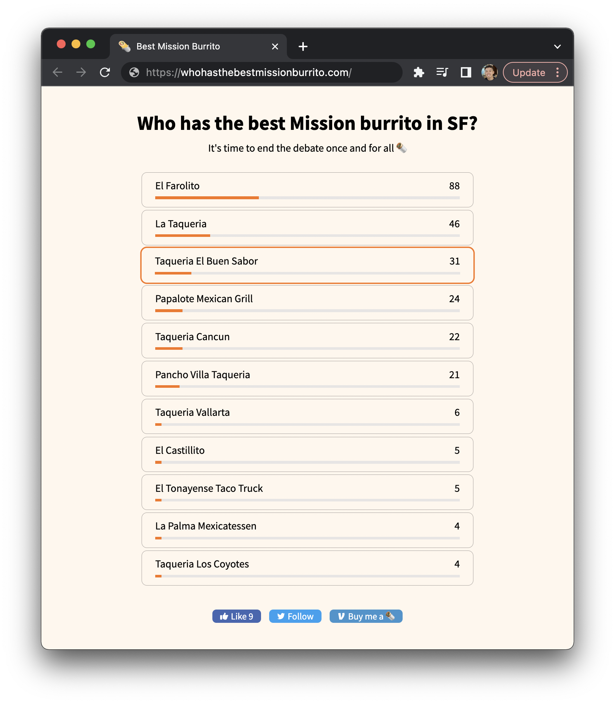

# Who has the best Mission burrito?

Just a simple webapp where people can vote for what they think is the best
taqueria that serves Mission burritos in San Francisco.

This website is accessible at
[whohasthebestmissionburrito.com](https://whohasthebestmissionburrito.com).
A screenshot of the website is shown below.



## Why?

I've gotten in countless debates with friends and non-friends arguing about
which taqueria is the best. I got frustrated. So here it is.

That said, I also wanted to create the webapp just to see how fast I can develop
it. I did most of the work in two or three days. This also gives me a template
to build more similar (simple) webapps in the future.

## Tech stack

The old implementation is just a classic MERN stack (MongoDB, Express, React,
Node) with TailwindCSS as my front-end framework. The current implementation is
just a serverless website deployed on Netlify and Supabase (no server). Code for
the server is still in this repo, but the front-end doesn't call it anymore.

## Deployment for MERN

IMPORTANT: This is deprecated, as the server isn't used anymore in favor of a
serverless implementation. To deploy on MERN, see commit 647c661.

I followed
[this](https://betterprogramming.pub/deploy-mern-stack-app-on-aws-ec2-with-letsencrypt-ssl-8f463c01502a)
post to deploy my MERN stack online. I also did the following:
* In `default.conf`, inside the `server` block, I added:
```
location /api/ {
    proxy_pass http://localhost:5000/api/;
}
```
* I whitelisted the IP address of the server in MongoDB Atlas.

If stopping/restarting the AWS instance, don't forget to:
* Update the IP address in the DNS
* Run `pm2 update` to restart the service
* Whitelist the new IP address in MongoDB

If testing on your local machine, remember to add the `ATLAS_URI` environment
variable to `config.env`. Note that this should include the database name too
in case your database name isn't the default value `test`. This should look
like:
```
mongodb+srv://<username>:<password>@cluster0.vbaw8.mongodb.net/<database_name>?retryWrites=true&w=majority
```

## Serverless deployment

In a nutshell, create a table in a custom schema called private and implement
SECURITY DEFINER functions in the public schema to access this table. This is to
practice [schema
isolation](https://postgrest.org/en/v7.0.0/schema_structure.html#schema-isolation).
See supabase.md for more information.

## Contact

Email me at <edward@edwardahn.me>!
